# Лабораторная работа №6
## Цель
Изучение базовых возможностей системы управления версиями, опыт работы с Git Api, опыт работы с локальным и удаленным репозиторием.
## Ход работы
1. Создан аккаунт на сайте GitHub
2. Сделана копия в личное хранилище из указанного репозитория (рис. 1)  
   
3. Установлен Git
4. После установки настроен клиент git (рис.2)
   
5. Клонирован личный удаленный репозиторий на компьютер (рис.3)
   
6. Добавлен файл через интерфейс GitHub. Подтянуты изменения в локальный репозиторий (рис.4)
   
7. Получена история операций для каждой из веток 
   
   История операций для ветки master (рис.5)
   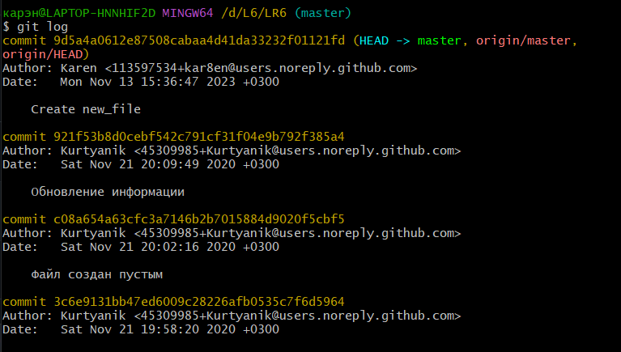

   История операций для ветки branch1 (рис.6)
   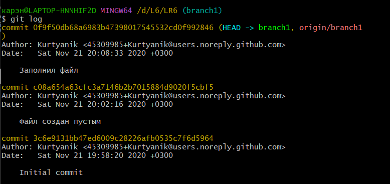
8. Просмотрены последние изменения
   
   Последние изменения ветки master (рис.7)
   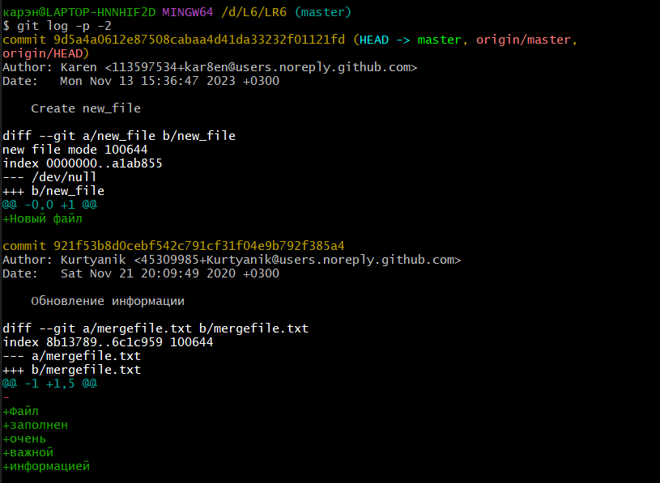

   Последние изменения ветки branch1 (рис.8)
   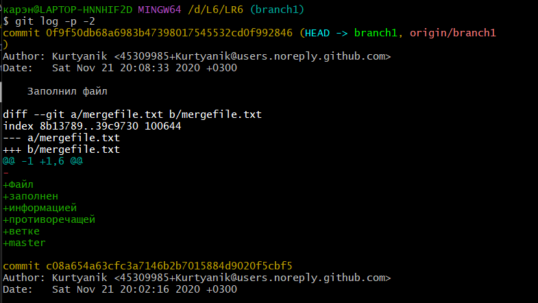
9. Выполнено слияние в ветку master. Разрешен конфликт (рис. 9)
    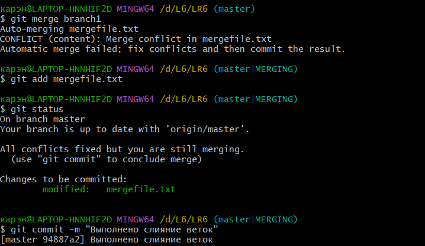
10. Удалена побочная ветка branch1 после слияния (рис.10)
    
11. Сделаны и зафиксированы изменения
    
    Добавлен файл new1.txt (рис.11)
    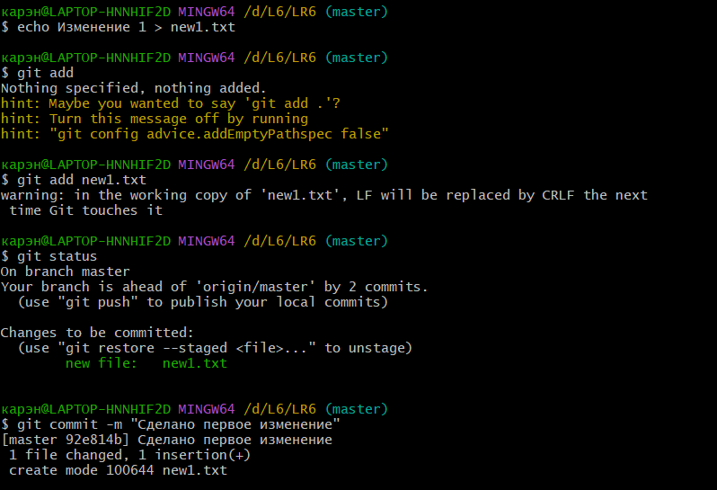
    
    Изменён файл new1.txt (рис.12)
    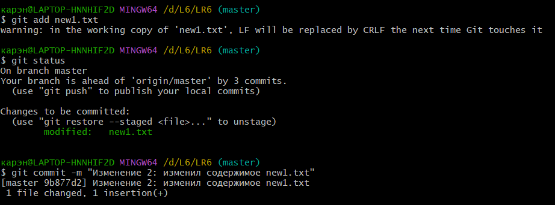

    Добавлен файл new2.txt (рис.13)
    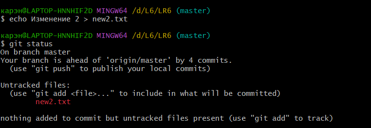

    Итоговая история операций (рис.14)
    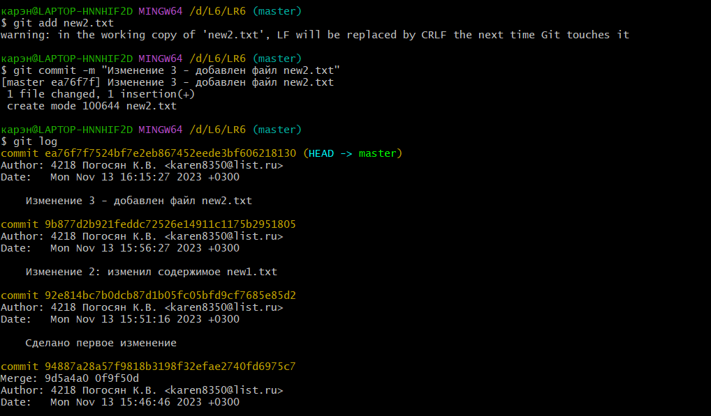

12. Сделан откат коммита (рис.15)
    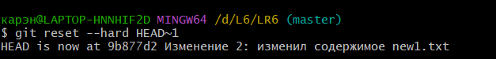
13. Создана ветка для отчёта (рис.16)
    
14. Оформляется отчет в файле README.md (с использованием markdown) 
15. Получена история операций в форматированном виде (рис.17)
    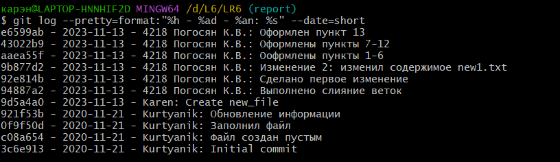
16. Затем отправляются локальные изменения в сетевое хранилище Git Hub
## Вывод
Изучены базове возможности системы управления версиями, получен опыт работы с Git Api, опыт работы с локальным и удаленным репозиторием.

