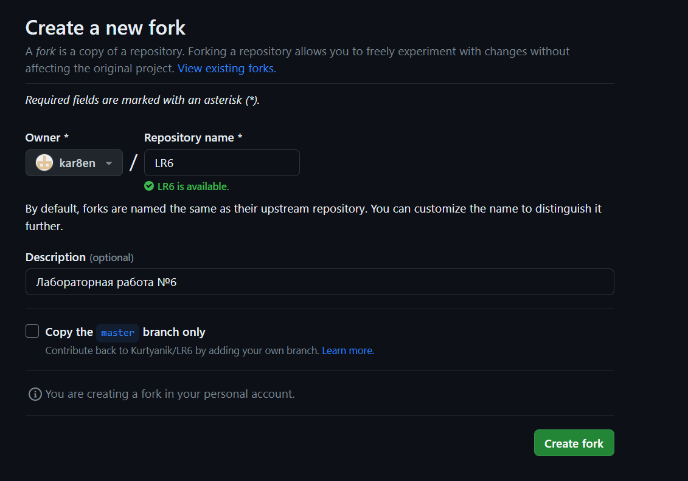
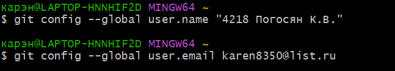
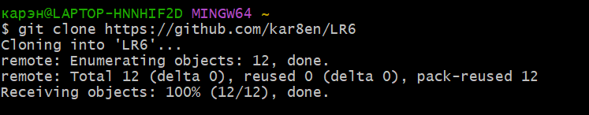
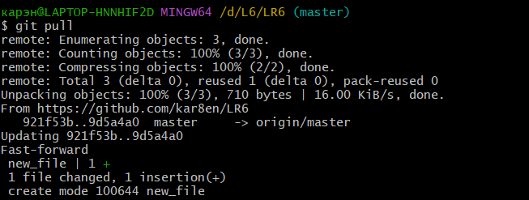

# Лабораторная работа №6
## Цель
Изучение базовых возможностей системы управления версиями, опыт работы с Git Api, опыт работы с локальным и удаленным репозиторием.
## Ход работы
1. Создан аккаунт на сайте GitHub
2. Сделана копия в личное хранилище из указанного репозитория (рис. 1)  
   
3. Установлен Git
4. После установки настроен клиент git (рис.2)
   
5. Клонирован личный удаленный репозиторий на компьютер (рис.3)
   
6. Добавлен файл через интерфейс GitHub. Подтянуты изменения в локальный репозиторий (рис.4)
   

