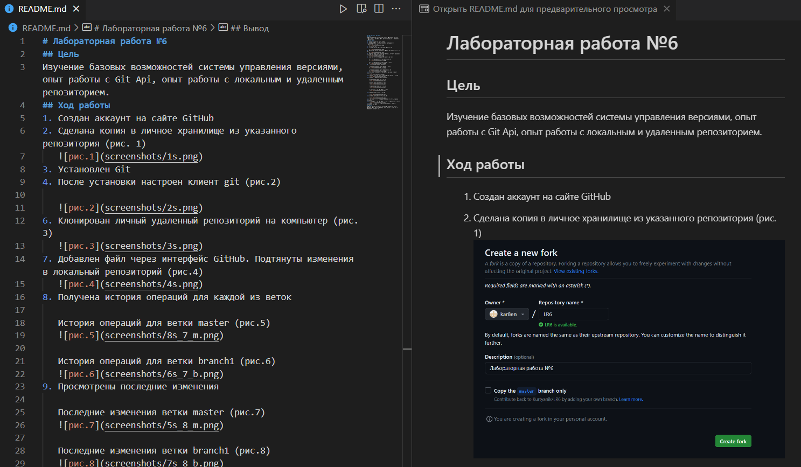

# Лабораторная работа №6
## Цель
Изучение базовых возможностей системы управления версиями, опыт работы с Git Api, опыт работы с локальным и удаленным репозиторием.
## Ход работы
1. Создан аккаунт на сайте GitHub
2. Сделана копия в личное хранилище из указанного репозитория (рис. 1)  
   
3. Установлен Git
4. После установки настроен клиент git с помощью команд `git config --global user.name` и `git config --global user.email` (рис.2)
   
   
6. Клонирован личный удаленный репозиторий на компьютер с помощью команды `git clone <url>` (рис.3) 
   
7. Добавлен файл через интерфейс GitHub. Подтянуты изменения в локальный репозиторий с помощью команды `git pull` (рис.4)    
   
8. Получена история операций для каждой из веток c помощью команды `git log`
   
   История операций для ветки master (рис.5)
   

   История операций для ветки branch1 (рис.6)
   
9. Просмотрены последние изменения с помощью команды `git log -p -2`
   
   Последние изменения ветки master (рис.7)
   

   Последние изменения ветки branch1 (рис.8)
   
10. Выполнено слияние в ветку master c помощью команды `git merge <name_branch>`. Разрешен конфликт (рис. 9)
    
11. Удалена побочная ветка branch1 после слияния с помощью команды `git branch -d <name_branch>` (рис.10)
    
12. Сделаны и зафиксированы изменения с помощью команд `git add` и `git commit -m <commit>`
    
    Добавлен файл new1.txt (рис.11)
    
    
    Изменён файл new1.txt (рис.12)
    

    Добавлен файл new2.txt (рис.13)
    

    Итоговая история операций (рис.14)
    

13. Сделан откат коммита с помощью команды `git reset —hard HEAD~1` (рис.15)
    
    
15. Создана ветка для отчёта с помощью команды `git checkout -b <name_branch>` (рис.16)
    
    
17. Оформлен отчет в файле README.md (с использованием markdown) с помощью Visual Studio Code (рис.17)
     
19. Получена история операций в форматированном виде c помощью команды `git log --pretty=format: "%h - %ad - %an: %s" --date=short` (рис.18)

    
21. Затем отправляются локальные изменения в сетевое хранилище Git Hub
## Лог команд 
- `git config --global user.name`: установка глобального имени пользователя для Git
- `git config --global user.email`: установка глобального адреса электронной почты пользователя для Git
- `git clone <url>`: создание локальной копии удаленного репозитория Git
- `git pull`: извлечение изменений из удаленного репозитория и объединение их с локальной веткой
- `git log`: отображение истории коммитов в репозитории
- `git checkout <branch>`: переключение между ветками
- `git log -p -2`: отображение двух последних коммитов с различиями внутри каждого коммита
- `git merge <name_branch>`: объединение указанной ветки с текущей веткой
- `git add`: добавление изменений файлов в индекс для коммита
- `git status`: отобраение текущего состояния репозитория, включая измененные, добавленные и неотслеживаемые файлы
- `git checkout -b <name_branch>`: создание новой ветки и переключение на нее
- `git commit -m <commit>`: создание коммита с указанным сообщением
- `git reset --hard HEAD~1`: отмена последнего коммита и переключение текущей ветки на предыдущий коммит
- `git branch -d <name_branch>`: удаление указанной ветки
- `git log --pretty=format: "%h - %ad - %an: %s" --date=short`: отображение истории коммитов в форматированном виде, включая хеш коммита, дату, автора и сообщение коммита
## Вывод
Изучены базовые возможности системы управления версиями, получен опыт работы с Git Api, опыт работы с локальным и удаленным репозиторием.

